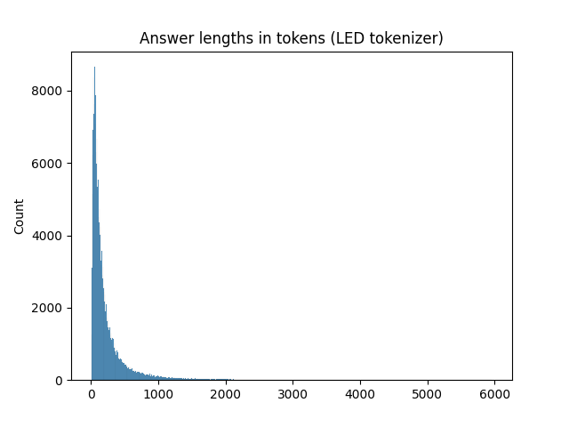
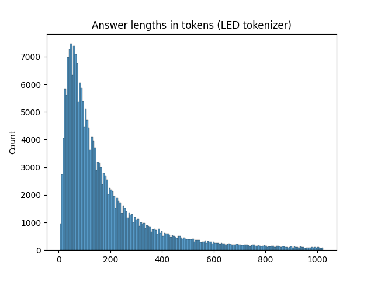

---
dataset_info:
  features:
  - name: question
    dtype: string
  - name: answer
    dtype: string
  - name: context
    sequence: string
configs:
- config_name: default
  data_files:
  - split: train
    path: data/train-*
  - split: validation
    path: data/validation-*
license: mit
task_categories:
- question-answering
- text2text-generation
language:
- en
size_categories:
- 100K<n<1M
---


# Dataset Card

## Table of Contents
- [Table of Contents](#table-of-contents)
- [Dataset Description](#dataset-description)
  - [Dataset Summary](#dataset-summary)
- [Dataset Structure](#dataset-structure)
  - [Data Instances](#data-instances)
  - [Data Fields](#data-fields)
  - [Data Splits](#data-splits)
- [Additional Information](#additional-information)
  - [Licensing Information](#licensing-information)

## Dataset Description

The dataset contains simple, long-form answers to questions and corresponding contexts.
Similar to ELI5 but with context.

This dataset is a filtered version of [LLukas22/lfqa_preprocessed](https://huggingface.co/datasets/LLukas22/lfqa_preprocessed),
which in turn is a processed and simplified version of of [vblagoje's](https://huggingface.co/vblagoje) *[lfqa_support_docs](https://huggingface.co/datasets/vblagoje/lfqa_support_docs)* and *[lfqa](https://huggingface.co/datasets/vblagoje/lfqa)* datasets.

I have filtered out overly long answers, based on the number of tokens in the answer using the LED tokenizer.
It can be reproduced with the notebook `process-lfqa-dataset.ipynb`. 

LLukas22/lfqa_preprocessed             |  stefanbschneider/lfqa-max-answer-length-1024
:-------------------------:|:-------------------------:
  |  
Max answer length: 5964 tokens | Max answer length: 1024 tokens (~6x shorter)
Num answers (train): 226147    | Num answers (train): 218894 (~3% less)


Details of the original LFQA dataset: [https://towardsdatascience.com/long-form-qa-beyond-eli5-an-updated-dataset-and-approach-319cb841aabb](https://towardsdatascience.com/long-form-qa-beyond-eli5-an-updated-dataset-and-approach-319cb841aabb)


## Dataset Structure

### Data Instances

An example of 'train' looks as follows.

```json
{
    "question": "what's the difference between a forest and a wood?",
    "answer": "They're used interchangeably a lot. You'll get different answers from different resources, but the ...",
    "context": [
        "Wood is divided, according to its botanical origin, into two kinds: softwoods, ...",
        "Processing and products differs especially with regard to the distinction between softwood and hardwood ..."
    ]
}
```

### Data Fields

The data fields are the same among all splits.

- `question`: a `string` feature.
- `answer`: a `string` feature.
- `context`: a list feature containing `string` features.


### Licensing Information

This dataset is distributed under the MIT licence.